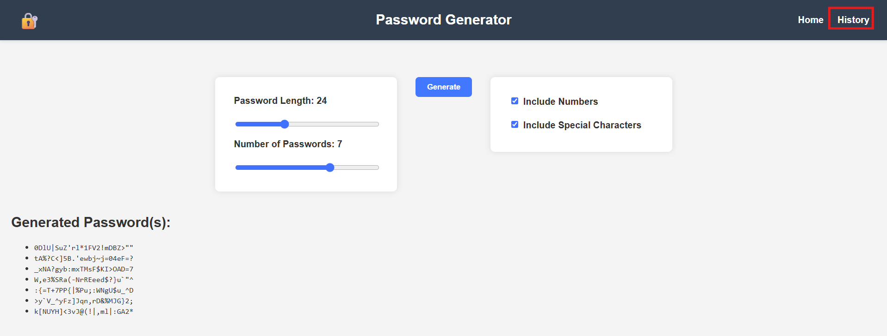

# Password Generator

A simple web-based password generator built with HTML, CSS, and JavaScript.

## Features

- Generates strong, random passwords based on user-selected criteria
- Options to include numbers, special characters, uppercase, and lowercase letters
- User-friendly interface with easy-to-use controls

## Demo

.png)
## How to Use

1. Open the `index.html` file in your web browser.
2. Select your desired password options.
3. Click the **Generate** button to create a new password.
4. Copy and use the generated password wherever needed.

## Technologies Used

- HTML
- CSS
- JavaScript

## Project Setup

No installation required. Just open the files in any modern web browser to use the app.
